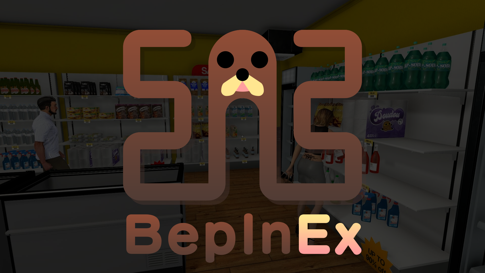

# Tobey's BepInEx Pack for Supermarket Simulator

This is a [BepInEx](https://github.com/BepInEx/BepInEx) pack for Supermarket Simulator, preconfigured and ready to use on Windows and Linux (including Steam Deck handhelds).

BepInEx is a general purpose framework for Unity modding. BepInEx includes tools and libraries to

-   load custom code (hereafter _plugins_) into the game on launch;
-   patch in-game methods, classes and even entire assemblies without touching original game files;
-   configure plugins and log game to desired outputs like console or file;
-   manage plugin dependencies.

BepInEx is currently [one of the most popular modding tools for Unity on GitHub](https://github.com/topics/modding?o=desc&s=stars).

## Compatibility with MelonLoader

> [!IMPORTANT]
>
> **As of the v1.1 update to Supermarket Simulator, MelonLoader compatibility is no longer supported by this pack.**

The v1.1 update to Supermarket Simulator made many significant changes to the game which collectively have rendered **all** mods broken. Any mods containing .dll files whether they are made for BepInEx or MelonLoader require updates to work, and as such we have made the decision to drop MelonLoader support since the majority of active Supermarket Simulator mod authors are using BepInEx to make and maintain their mods, and the magic glue we previously used to load MelonLoader mods with BepInEx is not supported for the latest IL2CPP game builds.

If you are a MelonLoader mod author, I humbly request that you please consider migrating to BepInEx moving forward - users will no longer be able to use both at the same time!

## Installation

> [!TIP]
>
> **Make sure to check out the [Installing mods](#installing-mods) section below once you have finished installing this pack!**

### Quick start

### Windows

Extract the archive into the game folder replacing any files if prompted, run the game once to generate all needed files and folders, if any prompts about MelonLoader appear just click Yes, then quit the game at the main menu and you're good to go. Remember to check the [Installing mods](#installing-mods) section below for info on how to install mods!

If something doesn't go according to plan or you need further guidance, please refer to the [full instructions](#full-instructions-for-windows-linux-and-steam-deck-handhelds) below. Don't worry, it looks harder than it is. **Please don't skimread!**

### Linux and Steam Deck handhelds

Same as for Windows but additionally follow step 4 from the [full instructions](#full-instructions-for-windows-linux-and-steam-deck-handhelds) below.

For Steam Deck handhelds, switch to Desktop mode to follow the instructions. Once you've got it all working, you'll be able to play with mods in either Desktop or Gaming mode as preferred.

### macOS

> [!IMPORTANT]
>
> **As of the v1.1 update to Supermarket Simulator, macOS is no longer directly supported by this pack.**

Sadly, after much testing, I have not been able to find a way to get mods to load with the native macOS copy of the game with this update. While BepInEx and MelonLoader do both have IL2CPP builds for macOS, neither seem to work with this game. I have discussed with some of the maintainers of these mod loaders and at this time it seems that it is an issue that will need further investigation from them to resolve.

In the meantime, this means that unfortunatley unless a solution or workaround is found, if you're playing a macOS copy of the game, you're out of luck.

That said, you may find some success if you are willing to use tools like CrossOver or HyperPlay etc. to install a Windows copy of Steam and the game, and configure your bottle with the environment variable `WINEDLLOVERRIDES="winhttp=n,b"`. This is not something that I will be directly supporting for the time being.

### Full instructions for Windows, Linux and Steam Deck handhelds

> [!TIP]
>
> **The game folder is the folder containing the game's executable (e.g. `Supermarket Simulator.exe`).**
>
> Steam users can find the game folder by right-clicking the game in their Steam library and selecting `Manage` > `Browse local files`.

1. [Download Tobey's BepInEx Pack for Supermarket Simulator](https://github.com/toebeann/BepInEx.SupermarketSimulator/releases/latest/download/Tobey.s.BepInEx.Pack.for.Supermarket.Simulator.zip).
2. Make sure the game is not running.
3. Extract the contents of the downloaded archive into the game folder. Replace any files if prompted.\

    **ℹ️** _That just means open the .zip file and drag the files and folders out into the game folder!_

    If done correctly, inside your `steamapps` > `common` > `Supermarket Simulator` folder it should look something like this (the entries in bold being from the pack):

    **⚠️ _This list is used as a reference and is non-exhaustive, there will be other stuff, please don't delete anything!_**

    - **`BepInEx`**
    - **`dotnet`**
    - `Supermarket Simulator_Data`
    - `baselib.dll`
    - **`doorstop_config.ini`**
    - `GameAssembly.dll`
    - `Supermarket Simulator.exe`
    - **`winhttp.dll`**

    **⚠️ _If you are missing any of these files or folders, you are probably installing to the wrong place, and this pack will not work._**

4. **Skip this step if you play on Windows!**

    Linux and Steam Deck handheld users: go to your Steam library, right-click the game, select `Properties...` and set the launch options:

    ```
    WINEDLLOVERRIDES="winhttp=n,b" %command%
    ```

    **⚠️ _Do not set the launch options if you play the game on Windows!_**

    **ℹ️** _If preferred, Linux users can instead set the Wine configuration (`winecfg`) for the game to add `winhttp` as a DLL override via the `Libraries` tab. Remove the launch options if applicable. [Full instructions here](https://docs.bepinex.dev/articles/advanced/proton_wine.html)._

5. Run the game from Steam as normal.

    > [!NOTE]
    >
    > **On first launch after installing this pack, it may take a while to load and you will not see any indication that anything is happening.**
    >
    > This is normal, be patient and wait - BepInEx is doing work in the background to prepare the game for modding. The process will be much faster on subsequent launches.

6. Exit the game at the main menu.

    Assuming you have followed these instructions correctly, inside the `Supermarket Simulator` > `BepInEx` folder there will now be a file `LogOutput.log` (or simply `LogOutput` - it's the same thing). This is your log file, and it will be regenerated every time the game runs with technical and diagnostic information about your installed mods. It's very useful for troubleshooting, and it is recommended to share it whenever asking for help with your mods. It is equivalent to the console window you might be familiar with, containing all of the same information.

    If this file is missing, it usually means that you have not installed the pack correctly and you should probably try again from scratch. Make sure to pay careful attention to the instructions and don't skimread any of the steps.

    Otherwise, you can now install mods according to the [Installing mods](#installing-mods) section below.

> [!IMPORTANT]
>
> **With just this pack installed, you will not see any changes in-game!**
>
> Check the file `Supermarket Simulator` > `BepInEx` > `LogOutput.log` to determine whether BepInEx has loaded.

## Installing mods

> [!IMPORTANT]
>
> **Always make sure the game is not running when installing, removing, or otherwise changing mod files!**

> [!WARNING]
>
> **If a mod tells you to install MelonLoader, it is incompatible with this pack!**
>
> Since v1.1 of Supermarket Simulator, MelonLoader is no longer compatible with BepInEx, which means that any mods made for MelonLoader are incompatible with any mods made for BepInEx, and vice versa. Moving forward, we hope that all mod authors for Supermarket Simulator migrate to BepInEx, which the majority already are using.
>
> If you do choose to install MelonLoader, BepInEx mods will stop working until you uninstall MelonLoader.

Installing BepInEx mods is generally as simple as opening up their .zip and dragging their contents into the right folder.

Typically, that folder is `Supermarket Simualtor` > `BepInEx` > `plugins`, unless the mod's instructions say otherwise.

There may be exceptions to this basic rule, so please do make sure to read the instructions of each mod you download - but remember that if a mod specifies that it requires MelonLoader, it is _not compatible_ with this pack, and if you install MelonLoader then any mods you have installed for BepInEx will stop working until you uninstall MelonLoader.

### I still can't figure it out!

First, double check and follow the instructions on the mod page. If you still can't figure it out or there aren't any instructions on the mod page, you'll have to get in touch with the author of the mod somehow. Your best bet is usually going to be the Nexus Mods posts tab of that mod. Make sure to check that the question hasn't already been asked and answered.

## Useful links for mod authors

-   [Doorstop: debugging Unity IL2CPP games](https://github.com/NeighTools/UnityDoorstop#debugging-in-il2cpp)
-   [BepInEx: writing basic plugin walkthrough](https://docs.bepinex.dev/master/articles/dev_guide/plugin_tutorial/index.html)
-   [BepInEx: useful plugins for modding](https://docs.bepinex.dev/master/articles/dev_guide/dev_tools.html)
-   [BepInEx: patching game methods at runtime](https://docs.bepinex.dev/master/articles/dev_guide/runtime_patching.html)
-   [Modded Supermarket Simulator Discord](https://discord.gg/hjGpjB3GXA)

## Issues, questions, etc.

First, please make sure to check that the answer you're looking for isn't already somewhere on this page. Use Ctrl+F to search for keywords.

Second, check [the FAQ](https://github.com/toebeann/BepInEx.SupermarketSimulator/wiki/FAQ) to see if there is an answer there.

If not, you can use the following channels to ask for help:

-   [Modded Supermarket Simulator Discord](https://discord.gg/hjGpjB3GXA)
-   [Nexus Mods posts tab](https://www.nexusmods.com/supermarketsimulator/mods/9/?tab=posts)
-   [GitHub issues](https://github.com/toebeann/BepInEx.SupermarketSimulator/issues)
-   [BepInEx Discord](https://discord.gg/MpFEDAg) -- **Intended for developers, only technical support for BepInEx itself will be provided. No support for mods.**

## Licensing

This GitHub repository contains no code or binaries from external sources.

However, the .zip released by this repository contains binaries from the following projects, redistributed without modification and in accordance with their licenses:

| Project                                       | License(s)                                                         |
| --------------------------------------------- | ------------------------------------------------------------------ |
| [BepInEx](https://github.com/BepInEx/BepInEx) | [LGPL-2.1](https://github.com/BepInEx/BepInEx/blob/master/LICENSE) |

The code in this repository is licensed under the [LGPL-3.0 license](https://github.com/toebeann/BepInEx.SupermarketSimulator/blob/main/LICENSE).
