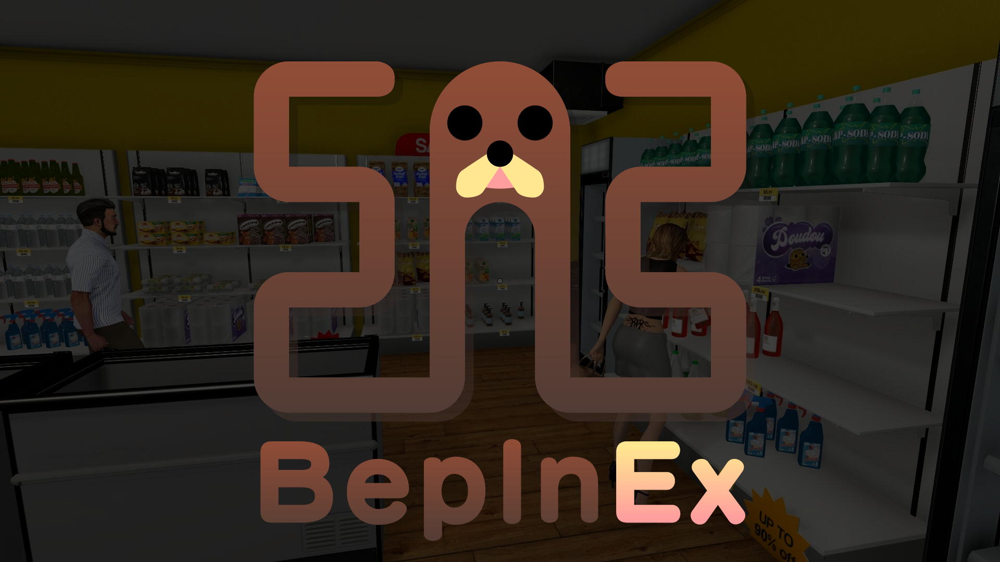

# Tobey's BepInEx Pack for Supermarket Simulator

This is a [BepInEx](https://github.com/BepInEx/BepInEx) pack for Supermarket Simulator, preconfigured and ready to use on Windows and Linux, including SteamOS and Steam Deck handhelds!

In particular, this pack comes with:

-   [Tobey's Game Info Logger for BepInEx](https://github.com/toebeann/Tobey.BepInEx.GameInfo), a simple BepInEx plugin to log information about the currently loaded Unity game,
-   [Tobey's File Tree Logger for BepInEx](https://github.com/toebeann/Tobey.FileTree), a configurable BepInEx plugin which logs the game's file tree to aid in troubleshooting issues,
-   [Tobey's Timestamp Logger for BepInEx](https://github.com/toebeann/Tobey.BepInEx.Timestamp), a configurable BepInEx patcher which logs the current timestamp, and
-   [yukieiji's UniverseLib fork](https://github.com/yukieiji/UniverseLib), a developer library for simple UI development, included so as to standardise the version used.

## IMPORTANT NOTES

**Only BepInEx mods updated for the Supermarket Simulator co-op update (v1.1 or newer) will work!**

BepInEx mods which have not been updated since the co-op update released on October 8th 2025 **will not work**.

[To browse mods which have been updated since October 8th 2025, click here.](https://www.nexusmods.com/games/supermarketsimulator/mods?timeRange=2025-10-09|&sort=updatedAt)

Unless otherwise stated, add-on packs (e.g. texture packs for TextureReplacer, product packs for MoreProducts, etc.) are **not** affected. In other words, you can use texture/product packs which have not been updated, as these packs are not themselves BepInEx mods. You do of course still need to update TextureReplacer and/or MoreProducts, though!

## Installation

> [!TIP]
>
> **Make sure to check out the [Installing mods](#installing-mods) section once you have finished installing this pack!**

> [!TIP]
>
> **The game folder is the folder containing the game's executable (e.g. `Supermarket Simulator.exe`).**
>
> Steam users can find this folder by right-clicking the game in their library and selecting `Manage` > `Browse local files`.
>
> PC Game Pass users can find this folder by right-clicking the game in their library, selecting `Manage`, navigating to the `Files` tab, clicking `Browse...` and finally navigating into the `Supermarket Simulator` > `Content` folder.

### Quick start

#### Windows

Extract the .zip into the game folder replacing any files if prompted, run the game once to prepare the game for modding (it can take a while for the game to launch, be patient), then quit the game at the main menu and you're good to go. Remember to check the [Installing mods](#installing-mods) section below for info on how to install mods!

If something doesn't go according to plan or you need further guidance, please refer to the [full instructions](#full-instructions-for-windows-linux-and-steam-deck-handhelds) below. Don't worry, it looks harder than it is. **Please don't skimread!**

#### Linux and Steam Deck handhelds

Same as for Windows but additionally follow step 4 from the [full instructions](#full-instructions-for-windows-linux-and-steam-deck-handhelds) below.

For Steam Deck handhelds, switch to Desktop mode to follow the instructions. Once you've got it all working, you'll be able to play with mods in either Desktop or Gaming mode as preferred.

#### macOS

Sadly, after much testing, I have not been able to find a way to get mods to load with the native macOS copy of the game since Supermarket Simulator v1.1 released. While BepInEx and MelonLoader do both have IL2CPP builds for macOS, neither seem to work with this game. I have discussed with some of the maintainers of these mod loaders and at this time it seems that it is an issue that will not be resolved for the foreseeable future. This means that unfortunately, if you're playing a macOS copy of the game, you're out of luck.

That said, you may find some success if you are willing to use tools like CrossOver or HyperPlay to install a Windows copy of Steam and the game, and then configure your bottle with the environment variable `WINEDLLOVERRIDES="winhttp=n,b"` or modify its Wine Configuration to add `winhttp` as an override in the **Libraries** tab. Please note that I offer no support for this.

### Full instructions for Windows, Linux and Steam Deck handhelds

> [!TIP]
>
> **The game folder is the folder containing the game's executable (e.g. `Supermarket Simulator.exe`).**
>
> Steam users can find this folder by right-clicking the game in their library and selecting `Manage` > `Browse local files`.
>
> PC Game Pass users can find this folder by right-clicking the game in their library, selecting `Manage`, navigating to the `Files` tab, clicking `Browse...` and finally navigating into the `Supermarket Simulator` > `Content` folder.

1. [Download Tobey's BepInEx Pack for Supermarket Simulator](https://github.com/toebeann/BepInEx.SupermarketSimulator/releases/latest/download/Tobey.s.BepInEx.Pack.for.Supermarket.Simulator.zip).
2. Make sure the game is not running.
3. Extract the contents of the downloaded archive into the game folder. Replace any files if prompted.\

    **ℹ️** _That just means open the .zip file and drag-and-drop the files and folders out into the game folder!_

    If done correctly, inside your game folder it should look something like this (the entries in bold being from the pack):

    **⚠️ _This list is used as a reference and is non-exhaustive, there will be other stuff, please don't delete anything!_**

    - _**`BepInEx`**_
    - `Supermarket Simulator_Data`
    - _**`doorstop_config.ini`**_
    - `Supermarket Simulator.exe`
    - _**`winhttp.dll`**_

    **⚠️ _If you are missing any of these files or folders, you are probably installing to the wrong place, and this pack will not work._**

4. **Skip this step if you play on Windows!**

    Linux and Steam Deck handheld users: go to your Steam library, right-click the game, select `Properties...` and set the launch options:

    ```
    WINEDLLOVERRIDES="winhttp=n,b" %command%
    ```

    **⚠️ _Do not set the launch options if you play the game on Windows, or the game won't run!_**

    **ℹ️** _If preferred, Linux users can instead set the Wine configuration (`winecfg`) for the game to add `winhttp` as a DLL override via the `Libraries` tab. Remove the launch options if applicable. [Full instructions here](https://docs.bepinex.dev/articles/advanced/proton_wine.html)._

5. Run the game from Steam as normal.

    **On first launch after installing this pack, it may take a while to load and you will not see any indication that anything is happening.**

    This is normal, please be patient and wait - BepInEx is doing some work in the background to prepare the game for modding. This process will be much faster on subsequent launches of the game, although the "first launch" process may repeat whenever the game updates.

    If you get stuck here and you have installed a third-party antivirus, it could be interfering with the set up process, so check for that and if you think it's blocking BepInEx then look up how to set up exclusions for your antivirus in its documentation - you may need to set it to exclude the `BepInEx` > `unity-libs` folder, possibly also `BepInEx` > `core`.

6. Exit the game at the main menu.

    Assuming you have followed these instructions correctly, inside the `BepInEx` folder there will now be a file `LogOutput.log` (or simply `LogOutput` - it's the same thing). This is your log file, and it will be regenerated every time the game runs with technical and diagnostic information about your installed mods. It's very useful for troubleshooting, and it is recommended to share it whenever asking for help with your mods. It is equivalent to the console window you might be familiar with, containing all of the same information.

    If this file is missing, it usually means that you have not installed the pack correctly and you should probably try again from scratch. Make sure to pay careful attention to the instructions and don't skimread any of the steps.

    Otherwise, you can now install mods according to the [Installing mods](#installing-mods) section below.

> [!IMPORTANT]
>
> **With just this pack installed, you will not see any changes in-game!**
>
> Check the file `BepInEx` > `LogOutput.log` to determine whether BepInEx has loaded.

## Installing mods

> [!IMPORTANT]
>
> **Always make sure the game is not running when installing, removing, or otherwise changing mod files!**

> [!WARNING]
>
> **If a mod tells you to install MelonLoader, it is incompatible with this pack!**
>
> Since v1.1 of Supermarket Simulator, MelonLoader is no longer compatible with BepInEx, which means that mods made for MelonLoader are incompatible with mods made for BepInEx. Moving forward, we hope that all mod authors for Supermarket Simulator migrate to BepInEx, which the majority already are using.
>
> If you do choose to install MelonLoader, be aware that any BepInEx mods you have installed will stop working until you uninstall MelonLoader.

Installing BepInEx mods is generally as simple as opening up their .zip and dragging their contents into the right folder.

Typically, that folder is `BepInEx` > `plugins`, unless the mod's instructions say otherwise.

There may be exceptions to this basic rule, so please do make sure to read the instructions of each mod you download - but remember that if a mod specifies that it requires MelonLoader, it is _not compatible_ with this pack, and if you install MelonLoader then any mods you have installed for BepInEx will stop working until you uninstall MelonLoader.

If you still can't figure out how to install a mod, double check and follow the instructions on the mod page. If there aren't any instructions on the mod page or you simply don't understand them, you'll have to get in touch with the author of the mod somehow. Your best bet is usually going to be the Nexus Mods posts tab of that mod. Make sure to check that the question hasn't already been asked and answered!

## Issues, questions, etc.

First, please make sure to check that the answer you're looking for isn't already somewhere on this page. Use Ctrl+F to search for keywords.

Second, check [the FAQ](https://github.com/toebeann/BepInEx.SupermarketSimulator/wiki/FAQ) to see if there is an answer there.

If not, you can use the following channels to ask for help:

-   [Modded Supermarket Simulator Discord](https://discord.gg/hjGpjB3GXA)
-   [Nexus Mods posts tab](https://www.nexusmods.com/supermarketsimulator/mods/9/?tab=posts)
-   [GitHub issues](https://github.com/toebeann/BepInEx.SupermarketSimulator/issues)

## Useful links for mod authors

-   [Doorstop: debugging Unity IL2CPP games](https://github.com/NeighTools/UnityDoorstop#debugging-in-il2cpp)
-   [BepInEx: writing basic plugin walkthrough](https://docs.bepinex.dev/master/articles/dev_guide/plugin_tutorial/index.html)
-   [BepInEx: useful plugins for modding](https://docs.bepinex.dev/master/articles/dev_guide/dev_tools.html)
-   [BepInEx: patching game methods at runtime](https://docs.bepinex.dev/master/articles/dev_guide/runtime_patching.html)
-   [UniverseLib: wiki](https://github.com/sinai-dev/UniverseLib/wiki/Initialization)
-   [Modded Supermarket Simulator Discord](https://discord.gg/hjGpjB3GXA)

## Licensing

This GitHub repository contains no code or binaries from external sources.

However, the .zip released by this repository contains binaries from the following projects, redistributed without modification and in accordance with their licenses:

| Project                                                                        | License(s)                                                                        |
| ------------------------------------------------------------------------------ | --------------------------------------------------------------------------------- |
| [BepInEx](https://github.com/BepInEx/BepInEx)                                  | [LGPL-2.1](https://github.com/BepInEx/BepInEx/blob/master/LICENSE)                |
| [Tobey.BepInEx.GameInfo](https://github.com/toebeann/Tobey.BepInEx.GameInfo)   | [LGPL-3.0](https://github.com/toebeann/Tobey.BepInEx.GameInfo/blob/main/LICENSE)  |
| [Tobey.BepInEx.Timestamp](https://github.com/toebeann/Tobey.BepInEx.Timestamp) | [LGPL-3.0](https://github.com/toebeann/Tobey.BepInEx.Timestamp/blob/main/LICENSE) |
| [Tobey.FileTree](https://github.com/toebeann/Tobey.FileTree)                   | [LGPL-3.0](https://github.com/toebeann/Tobey.FileTree/blob/main/LICENSE)          |
| [UniverseLib (yukieiji's fork)](https://github.com/yukieiji/UniverseLib)       | [LGPL-2.1](https://github.com/yukieiji/UniverseLib/blob/main/LICENSE)             |

The code in this repository is licensed under the [LGPL-3.0 license](https://github.com/toebeann/BepInEx.SupermarketSimulator/blob/main/LICENSE).
